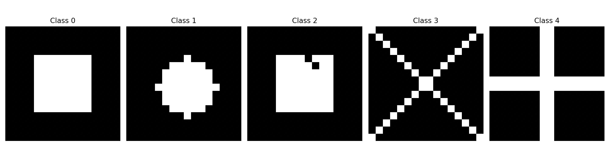

<div align = 'center'>


# npCNN

*A minimal implementations of Convolutional Neural Network built from scratch, in only NumPy!*

*There's no better way to learn, than building things out from scratch!*

If you see any bugs, errors, etc, feel free to raise an issue or create a pull request.

### TRAINING

This implementation of a CNN is unoptimized when compared to Deep Learning frameworks, as expected, given that it was built with only NumPy for learning purposes.

It struggled to run any variation of MNIST (Fashion MNIST, K-MNIST, etc), even on Google Colab, but was able to get decent results with a minimal dataset of $16 \times 16$ pixelized shapes (see below).

<br>
<div align = 'center'>
</img>
<br>
<em>Shapes!</em>
</div>
<br>

You can train the model as follows, feel free to tweak as you need. For more details on how to generate the dataset, check out the full script in [`train.py`](train.py) or [`generate.py`](generate.py)

</div >

```
# hyperparams
seed = 1
np.random.seed(seed)

layers = ['C', 'C', 'FC', 'FC']  # 2 convolutional layers, 1 fully connected layer
n_output_channels = [2, 4]  # First layer with 16 filters, second layer with 32
layer_size = [3, 3, 128, 5]  # 3x3 kernels, 128 units in the fully connected layer, 5 classes
activations = ['leakyrelu', 'leakyrelu', 'leakyrelu', 'softmax']  # LeakyReLU for conv layers, Softmax for output
padding = [1, 1]  # Padding to preserve spatial dimensions
stride = [1, 1]   # Stride of 1
dilation_rate = [(1, 1), (1, 1)]  # No dilation
param_init = 'glorot'  # Xavier/Glorot initialization for weights

nn = ConvNet(seed=seed)

print('############ TRAINING ############\n')

nn.train(
    X=X_train,
    y=Y_train,
    layers=layers,
    n_output_channels=n_output_channels,
    layer_size=layer_size,
    padding=padding,
    stride=stride,
    activations=activations,
    dilation_rate=dilation_rate,
    param_init=param_init,
    alpha=0.1, 
    epochs=100
)

print('\n############ TESTING #############\n')

nn.test(
    X_test = X_test,
    y_test = Y_test    
    
)
```

<div align = 'center'>

### MISC

While learning about the convolution operations, besides the ones that were implemented for the model itself, I wrote a couple of `.ipynb` files, which include some (unorganized) implementations for multiple ops, such as the convolution itself, max-pooling, mean-pooling, etc.

Feel free to check it out at [`misc`](misc)!

</div>